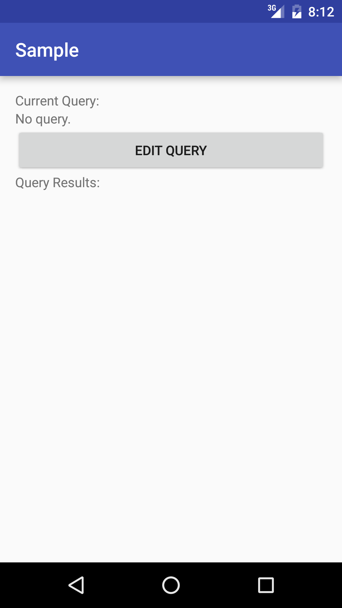
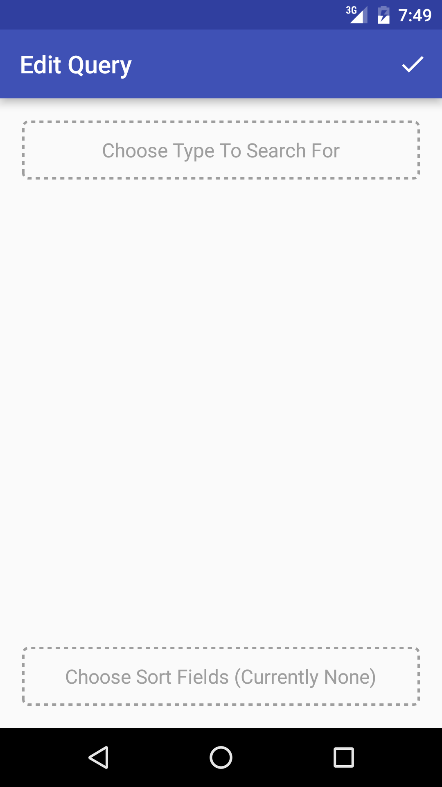
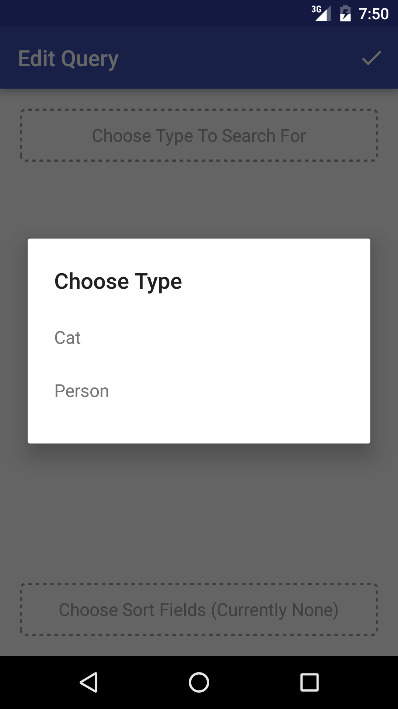
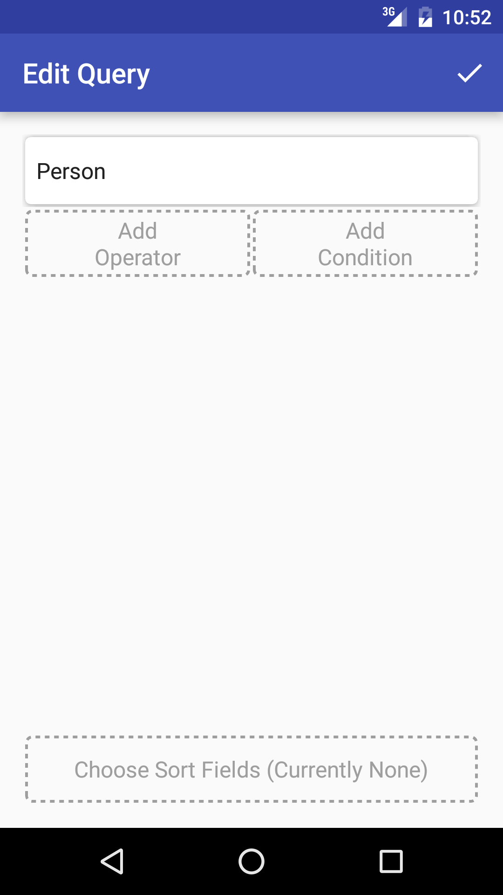
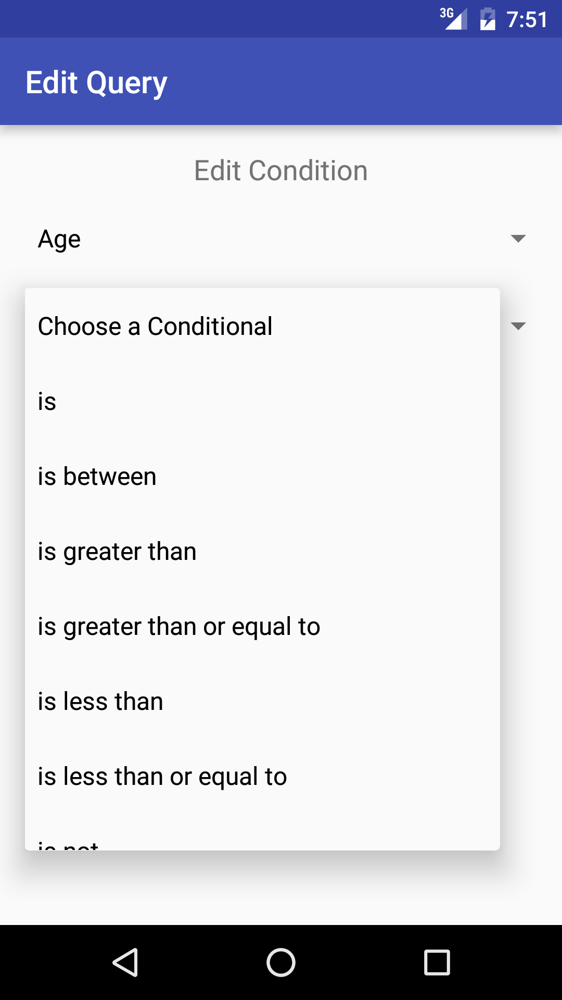
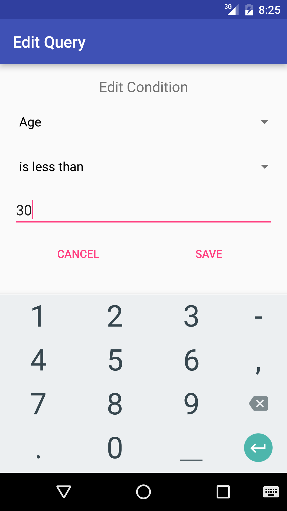
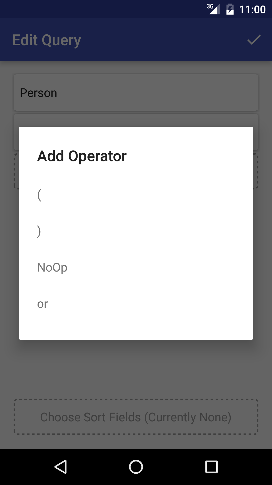
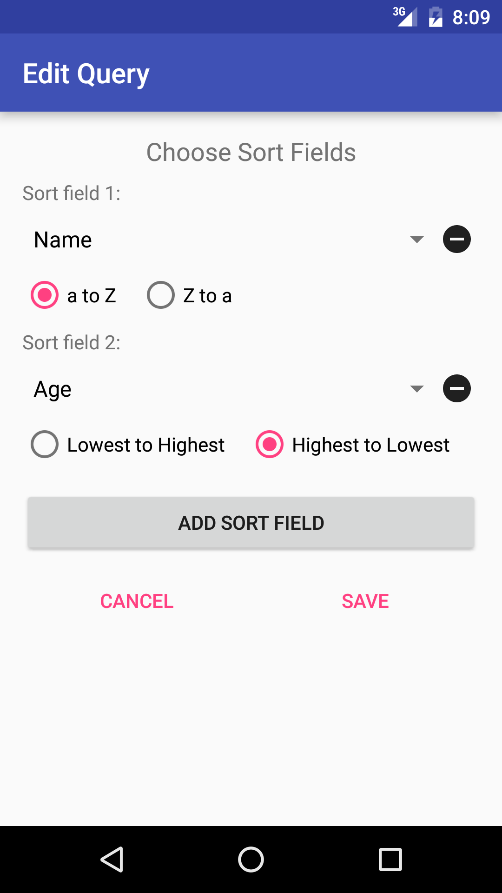
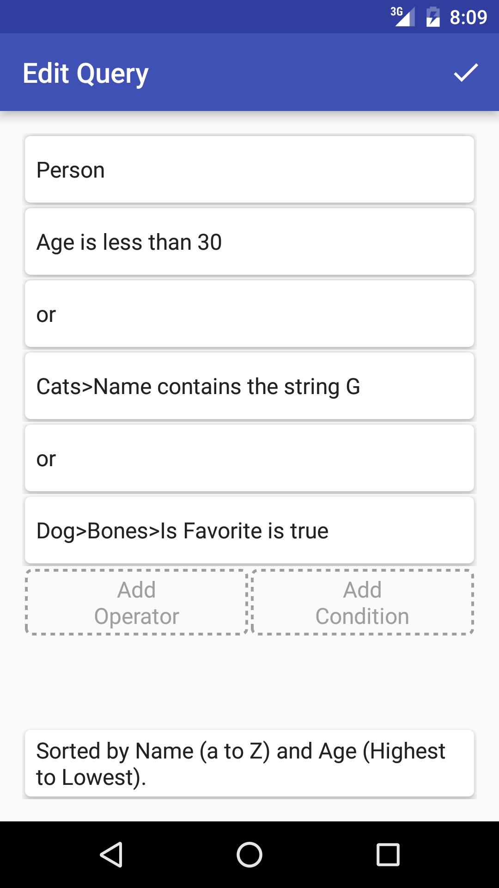
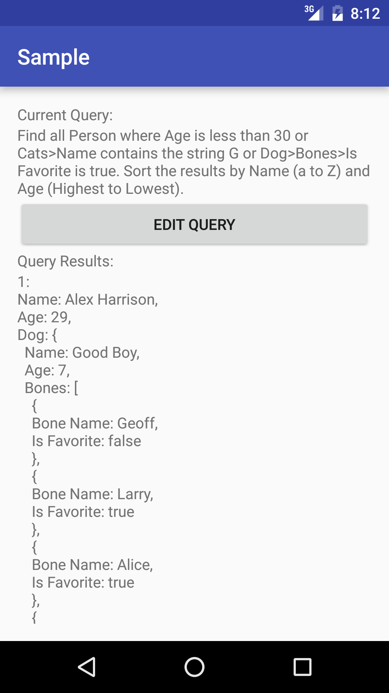

# Ruqus – Realm User Query System 🔎

Ruqus (pronounced "Ruckus") is an Android library which provides a number of components which allow your users to construct their own [Realm][Realm Java] queries. Users simply choose one of your model object classes, then they add any conditions, operators, and sort fields they wish. All of this information is stored in `RealmUserQuery` objects, which can then be turned into a `RealmResults` object using a single method call, just as if you had created the query at design-time yourself.

Sound awesome yet? What if I told you that Ruqus makes all of this possible with a minimal amount of reflection at run-time? This is possible because Ruqus uses an annotation processor to generate information about your model object classes at compile-time.

If you just want to know what's new, [the changelog is here][CHANGELOG].  
If you want to see how I use Ruqus in one of my apps, check out [Minerva][Minerva].

#### Table of Contents
* [Installation](#installation)  
* [The Basics](#basics)  
    * [Initializing Ruqus](#init)
    * [Adding a `RealmQueryView`](#rqv)
* [Model Annotations](#annotations)  
    * [`@Queryable`](#queryable)
    * [`@Hide`](#hide)
    * [`@VisibleAs`](#visible_as)
* [Transformers](#transformers)
* [Customizing](#customizing)
* [Troubleshooting](#troubleshooting)

<a name="screenshots"/>
#### Screenshots:
| Initial View | Initial RealmQueryView | Choosing Query Type | With Type Chosen |
|:---:|:---:|:---:|:---:|
|  |  |  |  |

| Adding/Editing a Condition 1 | Adding/Editing a Condition 2 | Adding an Operator |
|:---:|:---:|:---:|
|  |  |  |

| Editing Sort Fields | Filled RealmQueryView | Results |
|:---:|:---:|:---:|
|  |  |  |

<a name="installation"/>
## Installation
Including Ruqus in your app is pretty simple, just make sure that you have the following in your root `build.gradle` file:

```groovy
buildscript {
    repositories {
        jcenter()
    }
    dependencies {
        classpath 'com.neenbedankt.gradle.plugins:android-apt:1.8'
    }
}
```

And then add this to your app's `build.gradle` file:
```groovy
apply plugin: 'com.neenbedankt.android-apt'

dependencies {
    apt 'com.bkromhout.ruqus:ruqus-compiler:{latest version}'
    compile ('com.bkromhout.ruqus:ruqus-core:{latest version}@aar') {
        transitive = true
    }
}
```
Please note that at this time, Ruqus has been tested and is verified to work with **Realm 1.0.0**. Don't be afraid to try a newer version of Realm, just be sure to open an issue if you run into problems.

**Ruqus is compatible with Android API Levels >= 14.**

<a name="basics"/>
## The Basics
Ruqus relies on a number of annotations to help it generate information at compile-time.  
At a high level, the processor uses Realm's `@RealmClass` annotation to figure out which classes in your project are `RealmModel`s. Since `RealmObject` is annotated with `@RealmClass`, all of your model objects which extend it will automatically be picked up by the annotation processor. Any classes which implement `RealmModel` directly will also be picked up as long as they're annotated with `@RealmClass` (which they must be anyway for Realm to see them).

Ruqus also provides a few annotations which you should use to help the processor generate extra information about your model object classes. These are discussed [a little further down](#annotations).

Before that, however, there are a few things which must be done to make Ruqus work.

<a name="init"/>
### Initializing Ruqus
You **must** call `Ruqus.init(Context)` sometime before you handle `RealmUserQuery` objects or the user has the ability to interact with `RealmQueryView`s.  
I personally feel that the best place for this call to be made is in the `onCreate()` method of a custom Application class, as can be seen in the sample app's [`SampleApplication`][SampleApplication Class] class:
```java
public class SampleApplication extends Application {
    ...
    @Override
    public void onCreate() {
        super.onCreate();
        ...
        Ruqus.init(this);
        ...
    }
    ...
}
```

<a name="rqv"/>
### Adding a `RealmQueryView`
For users to build a query, they obviously need some sort of UI control to interact with; Ruqus provides such a thing in the form of the `RealmQueryView`. Before we get into how to add one to a layout and hook it up in code, there are a couple of things you should know:

* A `RealmQueryView` is a fairly space-hungry control; for the best user experience, I recommend having nothing else on the screen at the same time (for phones), or at the very least ensuring that there are no other views above or below it (tablets)
* `RealmQueryView` will save/restore its view state when configuration changes occur all by itself (unless you're doing something funky and interrupting Android's `onSaveInstanceState()`/`onRestoreInstanceState()` call hierarchy)

Keeping that in mind, I'd recommend creating a new empty activity to use as a query building activity and adding a `RealmQueryView` to it. You can see the sample app's [activity_edit_query.xml][EditQueryActivity Layout] file if you want, but this is what it boils down to:
```xml
<RelativeLayout xmlns:android="http://schemas.android.com/apk/res/android"
                android:layout_width="match_parent"
                android:layout_height="match_parent">

    <com.bkromhout.ruqus.RealmQueryView
            android:id="@+id/rqv"
            android:layout_width="match_parent"
            android:layout_height="match_parent"/>
</RelativeLayout>
```

Once you've done this, I highly recommend that you have your corresponding activity implement `RealmQueryView.ModeListener` so that it is notified when `RealmQueryView`'s mode changes. Again, you can look at the sample app's [`EditQueryActivity.java`][EditQueryActivity Class] file if you'd like, but here's what it boils down to:
```java
class EditQueryActivity implements RealmQueryView.ModeListener {
    RealmQueryView rqv;
    // Have this set to MAIN by default.
    RealmQueryView.Mode rqvMode = RealmQueryView.Mode.MAIN;

    @Override
    protected void onCreate(Bundle savedInstanceState) {
        super.onCreate(savedInstanceState);
        ...
        // Bind the RealmQueryView.
        rqv = (RealmQueryView) findViewById(R.id.rqv);

        // Ensure your save button is visible (or if it's a toolbar icon,
        // do it in onPrepareOptionsMenu() instead).
    }

    @Override
    protected void onResume() {
        super.onResume();
        // Register this activity with the view to be notified of mode changes.
        rqv.setModeListener(this);
    }

    @Override
    protected void onPause() {
        super.onPause();
        // Make sure the view doesn't hold onto a reference to the activity!
        rqv.clearModeListener();
    }

    @Override
    public void rqvModeChanged(RealmQueryView.Mode newMode) {
        rqvMode = newMode;

        // Do something to show your save trigger view if newMode is MAIN,
        // or to hide it if not.
    }
}
```
The reason for this is that `RealmQueryView` can be in main mode, or a builder mode; it logically makes sense have a button/toolbar action/etc visible to let the user save their query while in main mode, but not while in a builder mode. See [the screenshots at the top](#screenshots) and notice how the sample app shows/hides the check button in the toolbar based on the state of the `RealmQueryView`.

Another way you can integrate `RealmQueryView` to provide good UX is by overriding your activity's `onBackPressed()` method to have it call and check the return value of `RealmQueryView.leaveBuilderMode()`.  
This method will return `true` if calling it caused your `RealmQueryView` to return from one of the builder modes to the main mode, or `false` if it was already in the main mode. I recommend only following through with the default system behavior when `false` is returned, which will provide better UX:
```java
@Override
public void onBackPressed() {
    if (!rqv.leaveBuilderMode()) super.onBackPressed();
}
```

While I won't discuss these in detail here since the sample code is fairly straight-forward, there are a couple more key functionalities I recommend implementing:
* Structure your app so that your query builder activity is started using `startActivityForResult()`; then, when the query is saved, have it return a `RealmUserQuery` by putting it in the extras of an `Intent`.
* Similarly, if you want users to be able to edit an existing `RealmUserQuery`s, you can put it into the extras of the `Intent` used to *start* the query builder activity, and then pass it to the `RealmQueryView` using its `setRealmUserQuery()` method sometime during `onCreate()`.

Both of these are possible because `RealmUserQuery` implements Android's `Parcelable` interface.

<a name="annotations"/>
## Model Annotations

Ruqus includes a few annotations which you apply to your model objects to help it:

* Generate class/field data at compile-time
* Allow users to build queries against only the model objects which you include using only the fields which you don't exclude
* Specify "nice", human-readable names for model objects and fields

<a name="queryable"/>
### `@Queryable`
You annotate your model object classes with `@Queryable` if you want your users to be able to construct `RealmUserQuery`s which can produce `RealmResults` of that type.  
That is, if a model's class isn't annotated with `@Queryable`, users won't be able to build queries which return objects of that type.

The `@Queryable` annotation takes one **required** parameter called `name`, which you should consider to be a human-readable name for your model object that users will see.

Here's an example from the [`Person`][Person Class] class from the sample app:
```java
@Queryable(name = "Person")
public class Person extends RealmObject {
    ...
    private Dog dog;
    ...
}
```
This will allow users to build queries which return `Person` objects.

But notice that there's a `Dog`-typed field in `Person`. If we look at the [`Dog`][Dog Class] class from the sample app, notice that it *does not* have the `@Queryable` annotation:
```java
public class Dog extends RealmObject {
    ...
}
```
However, Ruqus will still generate information for the `Dog` class in order to support Realm's link queries.  
So in our sample app, users cannot build a query which returns `Dog` objects; but since our queryable class `Person` references the `Dog` class, they can build queries which return `Person` objects based on the linked `Dog` objects' fields. If this is still confusing, I'd recommend reading up on [Realm's link query functionality][Realm Link Queries].

<a name="hide"/>
### `@Hide`
It's fairly common for your model objects to have fields which you don't want users to be able to use when constructing queries. Ruqus will automatically skip any fields which are annotated with [Realm's `@Ignore` annotation][Realm Ignore], but for cases where you *do* want Realm to have a field, but you *don't* want users to be able to use it, annotate that field with `@Hide`.

Here's an example from the [`Person`][Person Class] class from the sample app:
```java
@Queryable(name = "Person")
public class Person extends RealmObject {
    ...
    @Ignore
    private int tempReference;
    @Hide
    private long id;
    ...
}
```
From the Ruqus annotation processor's point of view, the meaning of both `@Ignore` and `@Hide` are the same: Skip the field. So, users won't be able to use the `tempReference` or the `id` fields when building `Person` queries.

While `@Hide` may seem quite trivial in theory, thoughtful use of it is essential for guarding against [OOM errors causing your app to crash](#ts_oom).

Just one last thing; Ruqus will always skip all `static` fields and all `byte`/`Byte`/`byte[]`/`Byte[]` fields (because how would a user possibly add a condition against such fields?), so you needn't bother annotating those with `@Hide`.

<a name="visible_as"/>
### `@VisibleAs`
Ruqus's annotation processor will automatically convert **"TitleCase"** (for model objects *not* annotated with `@Queryable`) and **"camelCase"** (for fields) to visible names like **"Title Case"** and **"Camel Case"**.  
However, you're still likely to have cases where you want to give a model object or a field a specific name; that's what the `@VisibleAs` annotation is for.

Here's an example from the [`Cat`][Cat Class] class from the sample app:
```java
@RealmClass
@Queryable(name = "Cat")
public class Cat implements RealmModel {
    public String name;

    @VisibleAs(string = "Least Favorite Dog")
    public Dog leastFavorite;
    ...
}
```
When Ruqus generates data for the `Cat` class, the `name` field's visible name will be **"Name"**, and the `leastFavorite` field's visible name will be **"Least Favorite Dog"** (If we hadn't added the `@VisibleAs` annotation to it, it would have been **"Least Favorite"**).

<a name="transformers"/>
## Transformers
At this point you're probably a bit curious just how Ruqus actually makes it possible for your users to build `RealmQuery`s dynamically. Since a core design goal of Ruqus is to use as little reflection as possible, I needed a way to wrap the various methods on `RealmQuery` such they could be dynamically chained together, and this is what transformers allow us to do.

I personally feel that the quickest way to grok what a transformer is and how it functions is to look at a few of them, so go ahead, look some of [the transformers which come with Ruqus][Transformers Dir].

Here are some general guidelines which apply to all transformers:

* They all must extend the abstract `RUQTransformer` class
* They all must be annotated with the `@Transformer` annotation
* When Ruqus creates an instance of them, it uses their no-argument constructors to do so
* When Ruqus creates a human-readable version of the whole query string, it relies upon each transformer's `makeReadableString(...)` method to do so

Also, you'll need some more information about [the `@Transformer` annotation][Transformer Class]'s parameters:

* `String name`: This is the string which will be displayed to the user describing what the transformer does. All transformers must specify this
    * You can see what I've used for the built-in transformers in [`Names.java`][Names Class]
* `Class[] validArgTypes`: This is an array of `Class` objects which represent the types which a transformer's arguments can be. All transformers must specify this
    * You really shouldn't pass anything other than `Boolean.class`, `Date.class`, `Double.class`, `Float.class`, `Integer.class`, `Long.class`, `Short.class`, and `String.class` in this array, since those are the types which Ruqus supports and `RealmQuery`'s various methods will work with
    * It is important to note that while a transformer may accept multiple types *in general*, Ruqus will expect *all* of the arguments to be of the *same type* each time it calls a transformer's `transform(...)` method
    * i.e., if a transformer with two arguments accepts both `Integer` and `Long`, you can pass it two `Integer`s, or two `Long`s, but *not* one of each
* `int numArgs`: This determines how many arguments a transformer accepts. By default this is set to `1`, since most methods on `RealmQuery` take a `fieldName` plus one more argument
    * If you're thinking in terms of [the methods on `RealmQuery`][RealmQuery], note that this number *does not* include the extremely-common `fieldName` argument on those methods, only the other arguments
* `boolean isNoArgs`: Whether or not this is a no-arguments transformer. By default this is set to `false`, since in most cases you'll have no reason to set it otherwise
    * This may seem redundant since it appears at first glance that you could achieve the same effect by setting `numArgs` to `0`, but it isn't. Consider the methods [`RealmQuery.or()`][RealmQuery Or] and [`RealmQuery.isNull(String)`][RealmQuery IsNull]; the former legitimately has no arguments, while the latter takes the usual `fieldName` argument (which we ***don't count*** for `numArgs`!)
    * If a transformer has this set to true, Ruqus considers it to be an "Operator" rather than a "Condition".As you can see in [the screenshots at the top](#screenshots), this affects where in a `RealmQueryView` it will show up

Beyond this information, I recommend you take a look at [`EqualTo.java`][EqualTo Class], [`Between.java`][Between Class], and [`Or.java`][Or Class], since those provide good examples of differently structured transformers. You can also look at the [NoOp transformer][NoOp Class] included in the sample app (spoiler alert, it does nothing at all to the `RealmQuery` when its `transform(...)` method is called 😉).

Transformers are very powerful things! If you haven't realized why I'm spending so much time discussing them yet, allow me to clue you in: ***Ruqus lets you build your own transformers***, because just like your model object classes, Ruqus generates information for transformer classes at compile-time.

If you create a good, general-purpose transformer which I don't already have and you think others would benefit from its inclusion in the core Ruqus library, don't hesitate to open a pull request!

<a name="customizing"/>
## Customizing
You can override certain resources that used by Ruqus in order to customize it. The following resources can be overridden; I've provided their default values, as well as paired them so that you can see which ones go together (this is only really important for cards however):
```xml
<!-- Light theme -->
<color name="ruqus_backgroundColorLight">@android:color/white</color>
<!-- Light card -->
<color name="ruqus_cardBackgroundLight">@color/cardview_light_background</color>
<color name="ruqus_textColorPrimaryDark">#DE000000</color>
<!-- Light card alt -->
<color name="ruqus_cardBackgroundLightAlt">@color/ruqus_blue800</color>
<color name="ruqus_textColorPrimaryDarkAlt">@android:color/white</color>

<!-- Dark theme -->
<color name="ruqus_backgroundColorDark">@color/ruqus_grey700</color>
<!-- Dark card -->
<color name="ruqus_cardBackgroundDark">@color/cardview_dark_background</color>
<color name="ruqus_textColorPrimaryLight">@android:color/white</color>
<!-- Dark card alt -->
<color name="ruqus_cardBackgroundDarkAlt">@color/ruqus_blueGrey800</color>
<color name="ruqus_textColorPrimaryLightAlt">@android:color/white</color>
```
(Any of the default values which aren't present here can be seen in the actual file, but I'll save you some time and tell you that they correspond to Material Design colors.)

<a name="troubleshooting"/>
## Troubleshooting

<a name="ts_oom"/>
#### My app is crashing due to OOM errors!
This is, sadly, a fairly easy thing to cause depending on what relationships you have set up between your various model classes.  
The root of the problem is that you have a cycle of relationships, whether it be something like `A-->A`, `A-->B-->A`, etc; and that at least one of the classes in the cycle is annotated with `@Queryable` (or is referenced by a class which is).

To better illustrate how and why this issue occurs, let's use a simple example involving these classes:
```java
@Queryable(name = "A")
class A extends RealmObject {
    ...
    private B b;
    ...
}

class B extends RealmObject {
    ...
    private A a;
    ...
}
```
Say the user wants to build a query which returns `A` objects. What happens is that once they choose the kind of model they wish to build a query for (in this case, `A`), `RealmQueryView` makes a call to [`Ruqus.visibleFlatFieldsForClass(String)`][Ruqus Class], passing it the real name of the chosen model object class. That method, simply put, returns a list containing the following (in this case):

* Visible names of all fields on `A`, except those which were skipped (`@Ignore`/`@Hide`) and those which define a relationship (fields whose type is either some model object or a `RealmList` of model objects; in our example, the field `b` in class `A` falls into this category)
* For fields which define a relationship, such as field `b`, we traverse the relationship (`A-->B`) and:
    * The first rule is applied again, so we'd add all of `B`'s fields except for field `a`
    * Then the second rule is applied again, which causes us traverse the relationship `B-->A` to add `A`'s fields, thus creating a cycle

This should hopefully make it clear how cycles can cause issues. It also exposes the solution, which is to break cycles using the `@Hide` annotation.  
Ideally, one of the model classes involved in the cycle isn't annotated with `@Queryable`, in which case I'd recommend annotating the offending field in that class with `@Hide`:
```java
class B extends RealmObject {
    ...
    @Hide
    private A a;
    ...
}
```
However, you know your models' relationships better than I do, so you add the `@Hide` annotation where it will serve you best.  
My hope is that this will become a non-issue once the Android Realm library implements support for backlinks, since the current lack of support for them is what usually prompts us to build relationship cycles in the first place. In lieu of that, if someone knows of a clever way to defeat this issue I'd love to hear it; open an issue or a pull request!

[Realm Java]: https://github.com/realm/realm-java
[CHANGELOG]: CHANGELOG.md
[Minerva]: https://github.com/bkromhout/Minerva
[SampleApplication Class]: sample/src/main/java/com/bkromhout/ruqus/sample/SampleApplication.java
[EditQueryActivity Layout]: sample/src/main/res/layout/activity_edit_query.xml
[EditQueryActivity Class]: sample/src/main/java/com/bkromhout/ruqus/sample/EditQueryActivity.java
[Person Class]: sample/src/main/java/com/bkromhout/ruqus/sample/models/Person.java
[Dog Class]: sample/src/main/java/com/bkromhout/ruqus/sample/models/Dog.java
[Cat Class]: sample/src/main/java/com/bkromhout/ruqus/sample/models/Cat.java
[NoOp Class]: sample/src/main/java/com/bkromhout/ruqus/sample/NoOp.java
[Transformers Dir]: ruqus-core/src/main/java/com/bkromhout/ruqus/transformers
[Between Class]: ruqus-core/src/main/java/com/bkromhout/ruqus/transformers/Between.java
[EqualTo Class]: ruqus-core/src/main/java/com/bkromhout/ruqus/transformers/EqualTo.java
[Or Class]: ruqus-core/src/main/java/com/bkromhout/ruqus/transformers/Or.java
[Names Class]: ruqus-core/src/main/java/com/bkromhout/ruqus/transformers/Names.java
[RUQTransformer Class]: ruqus-core/src/main/java/com/bkromhout/ruqus/RUQTransformer.java
[Ruqus Class]: ruqus-core/src/main/java/com/bkromhout/ruqus/Ruqus.java
[Transformer Class]: ruqus-annotations/src/main/java/com/bkromhout/ruqus/Transformer.java
[Realm Link Queries]: https://realm.io/docs/java/latest/#link-queries
[Realm Ignore]: https://realm.io/docs/java/latest/#ignoring-properties
[RealmQuery]: https://realm.io/docs/java/latest/api/io/realm/RealmQuery.html
[RealmQuery Or]: https://realm.io/docs/java/latest/api/io/realm/RealmQuery.html#or--
[RealmQuery IsNull]: https://realm.io/docs/java/latest/api/io/realm/RealmQuery.html#isNull-java.lang.String-
